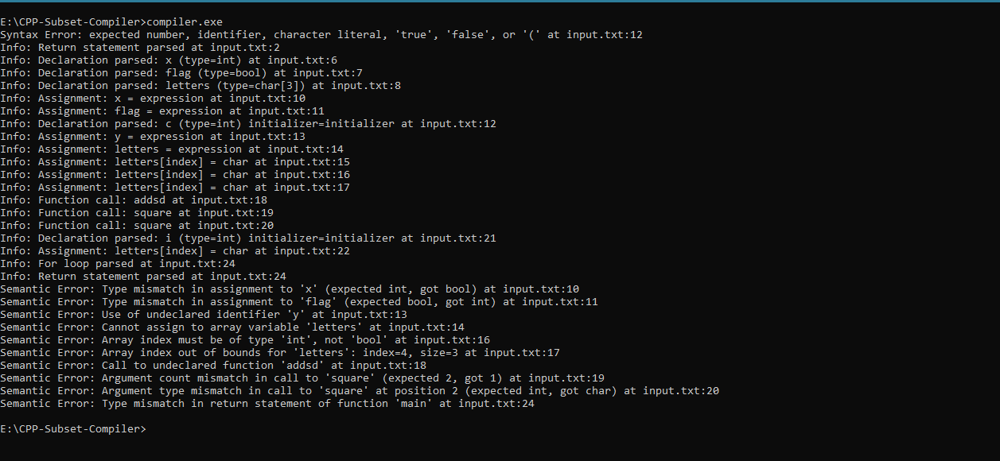

# Simple C++ Subset Compiler

**Authors:** Mehdi Abidi | Furzan Ahmed | Mufeed Zaidi

**Project:** Compiler Construction  

**Language:** C++

**Purpose:** Implement a compiler for a minimal subset of C++ supporting basic types, variable declarations, and expressions.

---

## **Project Description**

This project implements a **Simple C++ Subset Compiler** in C++.  
The language supports:

- **Keywords:** `int`, `char`, `bool`,`string`,`float`, `double`, `if`, `else`, `for`, `return`, `main`  
- **Primitive Data Types:** `int`, `char`, `bool` ,`string`,`float` ,`double`
- **Variable Declarations:** e.g., `int x;`, `char y;`  
- **Operators:** `+`, `-`, `*`, `/`, `=`, relational and logical operators (basic support in lexer)  
- **Control Constructs:** block statements, `if-else`, `for` (parser skeleton can be extended)  
- **Functions:** declaration and basic `main` function  

The compiler includes:

1. **Scanner (Lexer)** – tokenizes source code  
2. **Parser** – recursive-descent parser for variable declarations  
3. **Semantic Analyzer** – symbol table with basic type tracking  

---

## **Folder Structure**

```bash
SimpleCPP-Compiler/
│
├─ src/
│ ├─ scanner.h
│ ├─ scanner.cpp
│ ├─ token.h
│ ├─ parser.h
│ ├─ parser.cpp
│ ├─ semantic.h
│ ├─ semantic.cpp
│ └─ main.cpp
│
├─ input.txt
│
└─ README.md
```

---

## **Setup and Prerequisites**

- **C++ Compiler:** `g++` (MinGW-w64 on Windows, or GCC on Linux/macOS)  
- **Git:** for version control  

### **Install g++ on Windows**

1. Install MinGW-w64: [https://www.mingw-w64.org/downloads/](https://www.mingw-w64.org/downloads/)  
2. Add `bin` folder (e.g., `C:\mingw-w64\mingw64\bin`) to system PATH  
3. Verify installation:

```powershell
g++ --version
```

## Building the Compiler

Open PowerShell in your project folder:
```bash
cd E:\CPP-Subset-Compiler
g++ src/*.cpp -o compiler.exe -std=c++17
```

This compiles all .cpp files into compiler.exe

## Running the Compiler

Place your input program in input.txt, e.g.:
```bash
int square(int a, int b) {
    return a + b;
}

int main() {
    int x;
    bool flag;
    char letters[3];

    x = true;          // Semantic Error: assigning bool to int
    flag = 5;          // Semantic Error: assigning int to bool
    int c =;           // Syntax Error : Not assigning of value
    y = 10;            
    letters = 'A';    
    letters[0]='a';
    letters[flag] = 'Z'; // Semantic Error: index must be integer 
    letters[4]='b'; // Semantic Error: array out of bound access 
    addsd(x);      //Semantic Error: function undeclared semantic     
    square(5);  //Semantic Error : Argument count mismatched
    square(3,'a'); //Semantic Error: Argument Type mismatched
    for(int i=0;i<3;i++){
        letters[i]='a';
    }
    return 'c';      //Semantic Error : Return type not consistent                 
}
```

Run the compiler:
```bash
.\compiler.exe
```

### Output From Given Input File:

